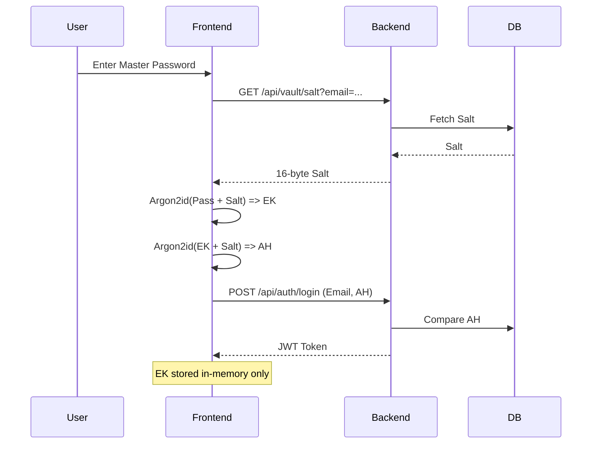
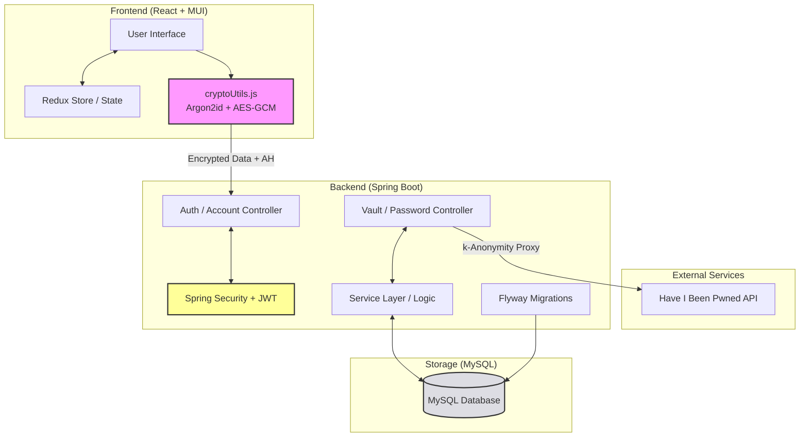
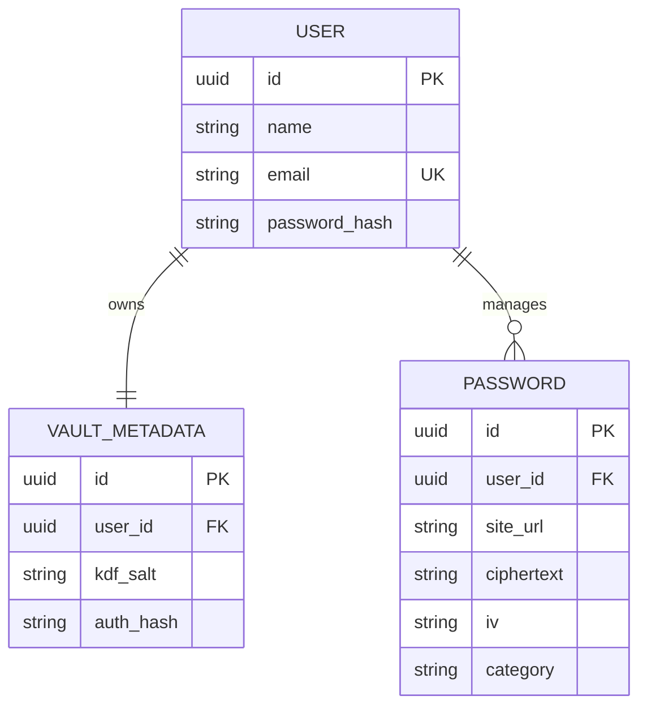

# Implementation Documentation: Password Vault
**Date:** January 15, 2026  
**Project Team:** Team 2

---

## 1. Introduction
**Password Vault** is a secure, full-stack credential management system designed to provide users with a centralized and encrypted environment for their digital identities. Built with a focus on privacy and performance, the application bridges a robust **Spring Boot** backend with a dynamic **React** frontend.

### Core Values
* **Security First:** Implements a **Zero-Knowledge** architecture. Sensitive data is encrypted on the client side or via secure protocols ensuring that the server never stores or "sees" passwords in plain text.
* **Proactive Protection:** Includes a breach detection system that alerts users if their credentials have been compromised in known third-party data leaks.
* **Scalability:** Utilizes server-side pagination and optimized database indexing to handle large volumes of vault items without performance degradation.
* **Seamless UX:** A modern interface powered by Redux for state management, offering a responsive experience across devices.

---

## 2. Technology Stack

The application follows a decoupled client-server architecture, utilizing industry-standard frameworks to ensure maintainability and security.

### 2.1 Backend (Server-Side)
| Technology | Usage |
| :--- | :--- |
| **Java / Spring Boot** | Core application framework and REST API provider. |
| **Gradle** | Build automation and dependency management. |
| **Spring Security & JWT** | Handles authentication and stateless session management via JSON Web Tokens. |
| **Hibernate / JPA** | ORM (Object-Relational Mapping) for database interactions. |
| **MySQL** | Relational database for persistent storage of encrypted data and user metadata. |

### 2.2 Frontend (Client-Side)
| Technology | Usage |
| :--- | :--- |
| **React** | Library for building the component-based User Interface. |
| **Redux Toolkit** | Centralized state management for vault data and authentication status. |
| **Material UI (MUI)** | Component library for building a responsive, modern design with a consistent theme. |
| **Axios** | Promise-based HTTP client for communication with the Backend API. |
| **Theme.js** | Centralized MUI configuration for custom colors, typography, and component overrides. |

### 2.3 Security & Encryption
* **Zero-Knowledge Authentication:** Ensures that the server can verify the user without ever receiving the actual Master Password.
* **End-to-End Encryption:** Data is encrypted/decrypted using cryptographic utilities (`cryptoUtils.js`) before being sent to or after being received from the database.
* **BCrypt/Hashing:** Strong hashing algorithms are applied to ensure that even the stored metadata remains secure against brute-force attacks.

---

## 3. Setup & Installation Guide

This guide provides the necessary steps to get the development environment running from scratch.

### 3.1 Prerequisites
Ensure the following are installed on your machine:
* **Java JDK 17** (The project uses the Java 17 toolchain).
* **Node.js** (LTS version recommended).
* **MySQL Server** (Running on port 3306).

---

### 3.2 Backend Setup (Spring Boot)

1. **Database Preparation:**
    * The application is configured to automatically create the database if it doesn't exist via the connection string: `createDatabaseIfNotExist=true`.
    * Ensure your MySQL server is running and your user has `CREATE` permissions.
    * If manual creation is preferred, run: `CREATE DATABASE passwordvault;` in your MySQL console.

2. **Environment Variables:**
    * In the `/backend` root directory, create a `.env` file based on `.env.example`:
      ```bash
      DB_URL=jdbc:mysql://localhost:3306/passwordvault?createDatabaseIfNotExist=true
      DB_USERNAME=root
      DB_PASSWORD=your_mysql_password
      HIBP_TEST_API_KEY=your_api_key_here
      ```

3. **Running Migrations & Starting Server:**
    * This project uses **Flyway** for database versioning. When you start the application, Flyway will automatically scan `src/main/resources/db/migration` and apply any pending SQL scripts to your MySQL instance.
    * Run the following command:
      ```bash
      ./gradlew clean bootRun
      ```
    * **Verification:** Check the console logs for `Flyway Community Edition ... successfully applied X migrations`.


---

### 3.3 Frontend Setup (React + Vite)

1. **Install Dependencies:**
    * Navigate to the `/frontend` directory and install the necessary packages:
      ```bash
      npm install
      ```

2. **Environment Variables:**
    * Create a `.env` file in the frontend root to point to the Spring Boot API:
      ```bash
      VITE_API_BASE_URL=http://localhost:8080/api
      ```

3. **Run Development Server:**
    * Start the Vite development server:
      ```bash
      npm run dev
      ```
    * The application will be available at `http://localhost:5173`.

---

### 3.4 Database Maintenance (Flyway)

To maintain a consistent database state across the team, follow these rules:
* **No Manual DDL:** Do not use `ALTER` or `CREATE` commands directly in the MySQL console.
* **Adding Changes:** To modify the schema, create a new `.sql` file in `src/main/resources/db/migration`.
* **Naming Convention:** Use the format `V[Version]__[Description].sql` (e.g., `V2__add_category_to_passwords.sql`).
* **Validation:** On startup, Hibernate validates the schema against the entities (`spring.jpa.hibernate.ddl-auto=validate`). If there is a mismatch, the server will fail to start, ensuring data integrity.

---

## 4. Project Structure

### 4.1 Backend Structure (`/backend`)
* **`controller/`**: REST API endpoints (Entry points).
* **`model/`**: JPA Entities (`User`, `Password`, `VaultMetadata`).
* **`repository/`**: Spring Data JPA interfaces for database access.
* **`service/`**: Business logic and coordination between repositories and controllers.
* **`security/`**: JWT Filters, `SecurityConfig`, and User Details logic.
* **`dto/`**: Data Transfer Objects used to sanitize API requests/responses.

### 4.2 Frontend Structure (`/frontend/src`)
* **`app/`**: Core setup (`App.jsx`, `store.js`, `routes.jsx`).
* **`features/`**: Domain-driven modules.
    * **`auth/`**: Login, registration, and master password setup forms.
    * **`vault/`**: Password list, add/edit modals, and vault-specific logic.
    * **`breaches/`**: UI for Have I Been Pwned (HIBP) integration.
* **`utils/`**: Shared logic, most importantly `cryptoUtils.js` for client-side encryption.
* **`styles/`**: MUI theme configuration (`theme.js`) and global CSS.

---

## 5. Security & Zero-Knowledge Architecture

### 5.1 The Encryption Flow
We implement a **Zero-Knowledge Architecture** using the following technical steps:



1.  **Key Derivation (Argon2id):**
    * When a user logs in or unlocks the vault, the Master Password and a unique 16-byte salt are processed using the **Argon2id** algorithm (Config: 64MB memory, 3 iterations).
    * This produces a 32-byte **Encryption Key (EK)** used for data operations.
2.  **Authentication Hash (Secondary Derivation):**
    * To prevent the server from ever knowing the EK, we derive a second hash, the **Auth Hash (AH)**, by feeding the EK back into Argon2id.
    * This AH is what is sent to the server for verification during login and sensitive operations (like account deletion).
3.  **In-Memory Storage:**
    * The **Encryption Key** is stored strictly in memory (`memoryKey`) using a closure-based state in `cryptoUtils.js`.
    * It is **never** persisted to `localStorage`, `sessionStorage`, or cookies. Refreshing the browser tab wipes the key, effectively "locking" the vault.
4.  **Data Encryption (AES-GCM):**
    * Before data transmission, the frontend utilizes the Web Crypto API to encrypt data via **AES-GCM**.
    * A unique 12-byte **Initialization Vector (IV)** is generated for every single encryption operation. This ensures that even if the same password is saved twice, the stored ciphertexts will be completely different.

---


## 6. API Documentation

All API endpoints are prefixed with `/api`. Most endpoints require a valid **JWT Token** in the `Authorization: Bearer <token>` header, except for registration and login.

### 6.1 Authentication (`/api/auth`)
Handles user lifecycle and session management.

| Method | Endpoint | Description | Request Body |
| :--- | :--- | :--- | :--- |
| **POST** | `/register` | Creates a new user account. | `{ "name": "...", "email": "...", "password": "..." }` |
| **POST** | `/login` | Authenticates user and returns JWT. | `{ "email": "...", "password": "..." }` |
| **POST** | `/delete-account` | Deletes account using email and authHash. | `{ "email": "...", "authHash": "..." }` |

### 6.2 Vault Configuration (`/api/vault`)
Manages the Zero-Knowledge metadata (salts and hashes).

| Method | Endpoint | Description | Parameters / Body |
| :--- | :--- | :--- | :--- |
| **POST** | `/setup` | Initial setup of the vault metadata. | `{ "salt": "...", "authHash": "..." }` |
| **GET** | `/params` | Retrieves salt and authHash for a specific user. | `?email=user@example.com` |
| **GET** | `/salt` | Retrieves only the KDF salt for a specific user. | `?email=user@example.com` |

### 6.3 Password Management (`/api/passwords`)
Endpoints for CRUD operations on encrypted credentials. Includes advanced filtering and pagination.

| Method | Endpoint | Description | Notes |
| :--- | :--- | :--- | :--- |
| **GET** | `/` | Get all passwords (paginated). | Supports `page`, `size`, `sortBy`, `direction`, `search`, and `category`. |
| **POST** | `/` | Save a new encrypted password. | Requires `PasswordRequest` DTO. |
| **PUT** | `/{id}` | Update an existing password entry. | Requires `id` (UUID). |
| **DELETE**| `/{id}` | Remove a password from the vault. | Requires `id` (UUID). |

### 6.4 Breach Detection (`/api/breaches`)
Proxies requests to the **Have I Been Pwned (HIBP)** API to maintain security while hiding user IP/details from the third-party service.

| Method | Endpoint | Description | Security Detail |
| :--- | :--- | :--- | :--- |
| **GET** | `/pwnedpasswords/range/{prefix}` | Checks if a password hash prefix is in the leak DB. | Uses k-Anonymity (only 5 chars of hash sent). |
| **GET** | `/hibp/breachedaccount/{account}` | Checks if an email address has been compromised. | Proxies to HIBP v3 API. |

### 6.5 Account Management (`/api/account`)
Sensitive operations regarding the user's profile.

| Method | Endpoint | Description | Security Requirement |
| :--- | :--- | :--- | :--- |
| **DELETE**| `/` | Deletes the authenticated user's account. | Requires `X-Master-Password` header (Auth Hash). |

---

## 7. Key Implementation Details (Code Highlights)



### 7.1 Server-Side Pagination
The `PasswordController` utilizes Spring Data JPA's `Pageable` interface. This ensures that the application remains fast even if a user has thousands of passwords.
* **Default Sort:** Alphabetical by `title`.
* **Search:** Server-side filtering of encrypted metadata (titles/URLs).

### 7.2 Zero-Knowledge Validation
In `AccountController.java`, account deletion is protected by more than just a JWT. This ensures that even if a JWT is stolen, the attacker cannot delete the account without knowing the user's **Master Password** to generate the correct `authHash`.

```java
if (!providedAuthHash.equals(meta.getAuthHash())) {
        throw new ResponseStatusException(HttpStatus.FORBIDDEN, "Invalid master password");
}
```

## 8. Database Schema
The relational model is designed to maintain strict ownership and security of data.



* **`User`**: Stores identity information (name, email) and the BCrypt hash of the standard web login password.
* **`VaultMetadata`**: Linked **1:1** with the User. It stores the `kdfSalt` (required to derive the keys on any new device) and the `authHash` (used by the server to verify the user's identity without knowing their master password).
* **`Password`**: Linked **Many:1** with the User. Stores the encrypted data:
    * **`ciphertext`**: The Base64 encoded encrypted string.
    * **`iv`**: The unique initialization vector required for decryption.
    * **Metadata**: `site_url`, `username`, and `category`.

---

## 9. Frontend State Management (Redux)
We use **Redux Toolkit** to maintain a "Single Source of Truth" and handle asynchronous API logic.

* **`authSlice.js`**: Manages the authentication state (JWT token), the login status, and the current user's profile information.
* **`vaultSlice.js`**: Manages the collection of vault items. It handles:
    * Fetching paginated data from the backend.
    * Client-side filtering and searching logic.
    * **Optimistic UI updates**: Updating the local list immediately while the server processes the request to ensure a "snappy" user experience.
* **`store.js`**: The central configuration that combines these slices and provides the global state to the React component tree via the `<Provider>`.

